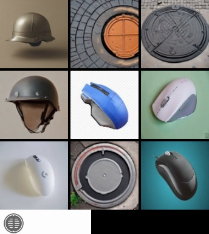

心血来潮写的<sub>绝对不是闲的</sub>   
由于鄙人为萌新（大学牲），仅仅了解Java不会springboot，springboot有bug的概率较高<sub>（其他的有bug概率也挺高🙂）</sub>，见谅  
~~写这个可能以后会写Android应用~~<sub>有空再说，忙死了(bushi) </sub>  
鸣谢：[UIGF-org/mihoyo-api-collect 提供mihoyo的api参考](https://github.com/UIGF-org/mihoyo-api-collect)，[Womsxd/MihoyoBBSTools 绝大部分签到内容由python转写为Java](https://github.com/Womsxd/MihoyoBBSTools)，[luguoyixiazi/test_nine 提供自动过码相关内容](https://github.com/luguoyixiazi/test_nine)，[springboot关闭](https://blog.csdn.net/afreon/article/details/115805084)，
[springboot 的使用由copilot帮忙写出](https://github.com/copilot) 还有感谢各位的支持

---

## 项目说明

<h2>本项目仅供学习使用，仅供学习参考，请勿用于非法用途</h2>
本项目包含获取stoken等参数，获取原神和绝区零（国服）的抽卡记录，获取米游社相关（游戏体力，每日任务（签到），获取文章等）  
有关验证码自动过码请参考项目[luguoyixiazi/test_nine](https://github.com/luguoyixiazi/test_nine)
，同时将[此处方法 getPassChallenge](https://github.com/MuxiaoWF/mi-Tech/blob/master/src/main/java/com/muxiao/bbs_daily.java#L200)

| 九宫格验证码            | 点选验证码            |
|-------------------|------------------|
|  |  |

本项目验证码均可通过打开本地网址(http://127.0.0.1:8080/verify-geetest.html)通过后继续使用

- [ ] 完成图片类型的输出

## 开始使用

### 登录

#### 获取设备信息

建议在项目第一次启动时调用一次，会自动保存设备信息，下次启动时直接读取

```java
import com.muxiao.tools;

public static void main(String[] args) {
    tools.files.setDeviceNameSpace("device_random_name");
    tools.files.setDeviceName("device_random_name");
}
```

#### <mark>***设置并使用用户名***</mark>  - 重要，必须设置

```java
import com.muxiao.tools;

public static void main(String[] args) {
    tools.files.addUser("user_name");
    String[] userList = tools.files.getUser();
    tools.files.setUser("user_name");
}
```

#### 获取stoken、mid等cookie参数

##### 通过手机号和验证码获取

[获取米游社验证码，不要直接登录，获取了验证码之后填在captcha这里](https://user.miyoushe.com/login-platform/mobile.html#/login/captcha)

```java

import com.muxiao.get_stoken;

public static void main(String[] args) {
    String[] stoken = get_stoken.getStokenByPhoneAndCaptcha("phone", "captcha");
    String[] stoken = get_stoken.getStokenByPhoneAndPassword("phone", "password");
    //stoken 的 [0]=stoken,[1]=mid,[2]=stuid, [3]=login_ticket
}
```

##### 通过扫码获取

```java
import com.muxiao.tools;
import com.muxiao.get_stoken_qrcode;

public static void main(String[] args) {
    tools.StatusNotifier notifier = new tools.StatusNotifier();
    notifier.addListener(status -> System.out.println("当前登录状态: " + status));
    //通过手机登录（返回二维码的byte数组），扫码登录后再调用getStoken方法 --给Android应用做的
    byte[] qrcode = get_stoken_qrcode.phone(notifier);
    String[] stoken = get_stoken_qrcode.getStoken();
    //通过电脑登录（直接显示java swing的二维码窗口）
    String[] stoken = get_stoken_qrcode.computer(notifier);
    //stoken 的 [0] stoken, [1] mid, [2] gameToken, [3] uid
    notifier.removeAllListeners();
}
```

### 抽卡记录

#### 获取抽卡记录网址（原神&绝区零）

```java
import com.muxiao.get_url;

public static void main(String[] args) {
    String url = get_url.genshin("your_stoken", "your_mid");
    //String url = get_url.zzz("your_stoken", "your_mid");
    System.out.println(url);
    //若使用本软件调用的登录方法，则不需要传入stoken和mid，会自动从保存文件中获取
    String url = get_url.genshin();
    //String url = get_url.zzz();
    System.out.println(url);
}
```

<mark>***接下来不再独立接入cookie，而是从文件中读取***</mark>

### 米游社相关

#### 米游社任务

```java
import com.muxiao.tools;
import com.muxiao.genshin_TCG;
import com.muxiao.bbs_daily;

public static void main(String[] args) {
    tools.StatusNotifier notifier = new tools.StatusNotifier();
    notifier.addListener(System.out::println);
    //创建对象，传入数组为需要社区签到的板块名称（米游币的那个）可填：崩坏3、原神、崩坏2、未定事件簿、大别野、星铁、绝区零
    bbs_daily b = new bbs_daily(new String[]{"绝区零"}, notifier);
    //运行签到任务，参数为是否签到，是否看帖，是否点赞，是否分享
    b.runTask(true, true, true, true);
    //运行游戏签到任务，领取游戏的每日签到奖励。参数可填:崩坏2，崩坏3，未定事件簿，原神，星铁，绝区零
    b.gameTask(new String[]{"原神", "崩坏3", "绝区零", "星铁"});
    //原神七圣召唤赛事中心任务 参数：每日签到，每周对战奖励
    new genshin_TCG(notifier, true, true);
    notifier.removeAllListeners();
}
```

#### 获取官方文章&获取文章的评论

```java
import com.muxiao.tools;
import com.muxiao.get_article;

public static void main(String[] args) {
    //游戏名 可填：崩坏3、原神、崩坏2、未定事件簿、大别野、星铁、绝区零 类型写123：1公告、2活动、3资讯（就是米游社上面的分类）
    //返回值:List<Map<String, String>> key： 文章id、文章标题、文章简介、文章首页图
    List<Map<String, String>> articleList = get_article.get_article_list("崩坏3", 1, notifier);//可加帖子数（0，50）
    String html = get_article.get_article_htmlCode("文章id"); //返回html源代码
    String text = get_article.get_article_only_text("文章id");//返回纯文本
    for (String reply : Objects.requireNonNull(get_article.get_reply("文章id"))) {
        System.out.println(reply);
        System.out.println("------------");//由于评论可能会换行，加入分割线方便显示
    }
}

```

#### 发送评论

```java
import com.muxiao.get_article;

public static void main(String[] args) {
    String result = get_article.sent_reply("评论内容", "文章id");
}
```

#### 获取小红点消息(可能重要的消息)

```java
import com.muxiao.get_article;

public static void main(String[] args) {
    String json_result = get_article.reddot();//返回的是json 数据
}
```

#### 获取奖励的信息通知

```java
import com.muxiao.get_article;

public static void main(String[] args) {
    String message = get_article.get_award();
    String message = get_article.get_award2();
}
```

#### 转发帖子

```java
import com.muxiao.get_article;

public static void main(String[] args) {
    System.out.println(get_article.share("文章id"));
}

```

#### 获取游戏角色信息

加了_analysed的是简要整合后的方法，返回的不再是json数据，而是编辑过的文本数据
同时，为防止多用户，部分方法返回的是List\<String\>类型数据

```java
import com.muxiao.user_info;

public static void main(String[] args) {
    //返回json数据
    System.out.println(user_info.Genshin.day());
    System.out.println(user_info.Genshin.world());
    System.out.println(user_info.Genshin.TCG());
    //返回编辑过的文本数据
    System.out.println(user_info.Genshin.day_analysed());
    System.out.println(user_info.Genshin.world_analysed());
    System.out.println(user_info.Genshin.TCG_analysed());
    //...方法过多，可自行看方法注释和另一个文件
}
```

...方法过多不再写出，可自行看方法注释和[文件](src/main/java/com/muxiao/user_info.md)
